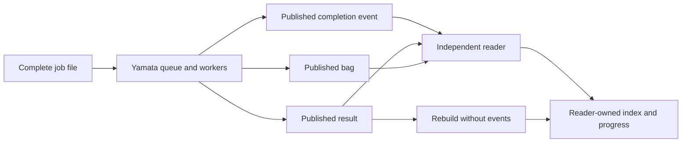

# Queue inspection and independent reading

Yamata owns accepted jobs and publishes their outcomes independently of any reader.
The example reader owns a separate result index and saved event progress.
Stopping the reader cannot stop an accepted job or consume a worker retry.



The reader is a [separate Go module](../examples/reader/README.md).
It uses its own pinned schemas and validates published references without importing worker code.
The reader does not open Yamata's queue database, send acknowledgments, or write producer files.

## Inspect a queued execution

Prerequisites: the [README tools and dependencies](../README.md#run-the-first-example), Python 3.11 or later, and a writable temporary directory.
From the repository root, run these commands in one shell:

```sh
make build
experiment=$(mktemp -d)
exchange="$experiment/exchange"
state="$experiment/reader"
rebuilt="$experiment/rebuilt"
mkdir -m 700 "$exchange" "$state" "$rebuilt"
cp -R examples/jobs "$exchange/jobs"
./bin/yamata enqueue --exchange-dir "$exchange" jobs/candidate.json
./bin/yamata fault --exchange-dir "$exchange" --job record-candidate --stage analysis --failures 1
./bin/yamata queue --exchange-dir "$exchange"
./bin/yamata workers --exchange-dir "$exchange" --analysis-workers 0 --drain
./bin/reader sync --exchange-dir "$exchange" --state-dir "$state"
./bin/reader list --state-dir "$state"
```

The first queue snapshot shows one pending simulation job and two unpublished intake files.
The failure configuration belongs to the analysis stage.
The simulation command publishes the bag and leaves analysis queued.
Reader sync reports `processed_events=3 indexed_results=0`, then exits.
The reader is now stopped while the execution remains unfinished.

Complete analysis while the reader is stopped:

```sh
./bin/yamata workers --exchange-dir "$exchange" --simulation-workers 0 --drain
./bin/yamata queue --exchange-dir "$exchange"
./bin/reader list --state-dir "$state"
```

The queue now shows `stage=done`, `state=FAIL`, `analysis_retries=1`, and no pending files.
The first analysis attempt failed deliberately; its single retry calculated the actual scores.
The reader still reports three processed events and an empty result index.
Its outage has not delayed result publication.

Queue output uses JSON and includes total stage counts, dispatch positions, and a page of jobs.
Each job exposes its priority, attempt, generation, lease expiration, retries, configured failures, and output paths.
It excludes raw input payloads and lease tokens.
An accepted result path can appear before publication finishes; check `pending_files` before opening it.
The `ready` field means the stage is unfinished, its lease is available, and its preceding files are acknowledged.

The default page contains up to 100 jobs in intake order.
For another page, pass the returned `next_after` value with `--after`; null means no further page.
Use `--limit` to request 1 through 1,000 jobs.
Each page is a consistent snapshot; later pages can reflect newer queue activity.
Inspection neither claims jobs nor initializes or upgrades a queue.
SQLite can maintain read-coordination sidecars while serving the snapshot.

## Restart and deliver duplicates

Continue in the same shell with the previous exchange and reader state:

```sh
python3 - "$exchange" <<'PY'
import json
from pathlib import Path
import shutil
import sys

exchange = Path(sys.argv[1])
terminal = next(path for path in (exchange / "events").glob("*.json")
                if json.loads(path.read_text())["result"] is not None)
shutil.copyfile(terminal, exchange / "events/duplicate.json")
PY
./bin/reader sync --exchange-dir "$exchange" --state-dir "$state"
./bin/reader list --state-dir "$state" > "$experiment/accepted-index.json"
./bin/reader sync --exchange-dir "$exchange" --state-dir "$state" events/duplicate.json events/duplicate.json
./bin/reader list --state-dir "$state" > "$experiment/repeated-index.json"
diff "$experiment/accepted-index.json" "$experiment/repeated-index.json"
```

Both scans report `processed_events=5 indexed_results=1`.
The extra file and repeated arguments carry an already accepted event identity.
They do not create another result or advance progress twice.
The comparison succeeds silently.

Event filenames contain hashes, so lexical order is not execution order.
The reader remembers every accepted event ID and its job sequence number.
It commits event progress and referenced results together.
An interrupted commit can be replayed without losing the result or duplicating it.
Changed bytes under an accepted identity produce an error.

## Rebuild without events

Continue in the same shell:

```sh
mv "$exchange/events" "$experiment/held-events"
./bin/reader rebuild --exchange-dir "$exchange" --state-dir "$rebuilt"
./bin/reader list --state-dir "$rebuilt" > "$experiment/rebuilt-index.json"
python3 - "$experiment" <<'PY'
import json
from pathlib import Path
import sys

experiment = Path(sys.argv[1])
accepted = json.loads((experiment / "accepted-index.json").read_text())
rebuilt = json.loads((experiment / "rebuilt-index.json").read_text())
assert rebuilt["processed_events"] == 0
assert rebuilt["results"] == accepted["results"]
print("The result index matches without event files.")
PY
mv "$experiment/held-events" "$exchange/events"
```

Rebuild reports `processed_events=0 indexed_results=1`.
It reads each result and its referenced job and bag, then replaces the index in one transaction.
The final comparison confirms that events are notifications, while result files own the scores.
A failed rebuild preserves the previous index.
After these checks, remove only this experiment and its built binaries:

```sh
rm -r "$experiment"
make clean
```

## Trace identities and files

| Identity or path | Purpose |
| --- | --- |
| `jobs/candidate.json` | Complete inputs for job `record-candidate`. |
| `stopped-candidate` | Execution ID connecting the original job and bag. |
| Queue attempt ID | Identifies the accepted worker attempt; a worker-failure retry receives another ID. |
| `bags/stopped-candidate.jsonl` | Immutable recording, pinned by its exact SHA-256 hash. |
| Analysis ID | Hash of execution ID, bag hash, and complete analysis-template hash. |
| `results/<analysis_id>.json` | Authoritative scores or explicit analysis failure. |
| `events/<event_id>.json` | Transition identified by job, attempt, and sequence; completion references the result hash. |
| Reader `reader.sqlite` | Reader-owned progress, identity history, and derived result index. |

A run failure before recording uses `results/<execution_id>-run.json` and has no analysis or bag reference.
The reader indexes that error without manufacturing scores.
Analysis-only jobs retain the execution and bag identities while producing separate analysis results.
The [reanalysis guide](reanalysis.md) compares two versions against one recording.

## Deterministic failures and recovery

Configure failures after intake and before the job's first claim, as shown above.
Both `simulation` and `analysis` accept failure counts of one or two.
One causes a worker failure followed by the existing retry policy.
Two cause both attempts to fail, leaving a terminal `ERROR` result.
A successful retry can still produce `FAIL` or `WARN` from actual scores.

Failure controls change only local worker behavior, not job files or public contract fields.
The configuration and consumed retry allowance persist across process restart.
Repeating the same configuration is idempotent; changing it or arming an already started job is rejected.
Create a fresh job for a different experiment.
Analysis-only jobs cannot receive simulation failures.
These controls never edit recordings, force passing scores, or weaken collision checks.

The new binary upgrades private queue schema versions one through three to version four when opening them for execution or intake.
Stop old processes before upgrading, following the [recovery guide](recovery.md#upgrade-an-existing-queue).
The upgrade preserves accepted files, existing jobs, scheduling positions, and retry records.
The public version-one contract remains unchanged.

| Observation | Action |
| --- | --- |
| Pending stage, no active lease | Start workers for that stage. |
| Pending files after a publication error | Correct the filesystem problem and restart workers. |
| Reader stopped or behind | Restart `reader watch`, or run `reader sync` once. |
| Reader reports a bad event or reference | Inspect the named publication problem, correct its source, and rerun sync. Other valid events can still commit. |
| Missing events or lost reader state | Rebuild into a fresh reader state directory from published result files. |
| Terminal worker failure | Use a fresh corrected job or analysis template; duplicate intake cannot reopen the outcome. |

## Verify process boundaries

Prerequisites: the tools above, with dependencies installed for both Go modules.
From the repository root, run:

```sh
make build
python3 tests/operations.py
make clean
```

The check starts separate engine and reader processes and kills the reader while analysis remains queued.
Workers then complete the job while that reader is down.
The check restarts reading, delivers duplicates, and rebuilds with both events and the producer database unavailable.
It also checks a second analysis, deterministic failures, retry exhaustion, and error-result indexing.
Expect two lines ending in `passed` and exit code `0`.
The check removes its temporary exchanges and reader databases automatically.

Reader scans have a 30-second deadline and bounded files, graph depth, and content size.
The [reader guide](../examples/reader/README.md#command-behavior) lists those limits and its failure behavior.
This is a local teaching implementation; it installs no service or schedule.
