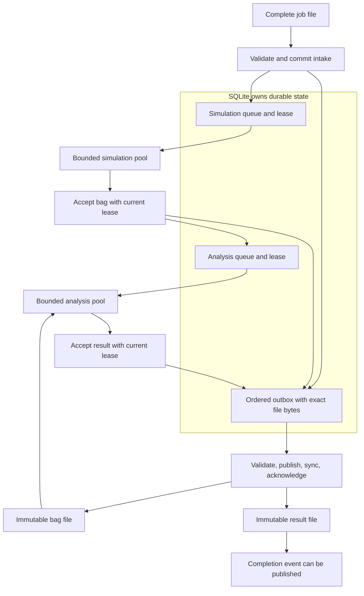

# Durable queues and worker pools

The `enqueue` command imports a complete run job into SQLite before printing its receipt.
The `workers` command runs separate simulation and analysis pools.
Both commands use an existing exchange directory.
No service installation or network connection is needed after dependency installation.

## Import and process a job

Prerequisites: the [README tools and dependencies](../README.md#run-the-first-example), a POSIX shell, and a writable local filesystem.
From the repository root, run these commands in the same shell:

```sh
make build
exchange=$(mktemp -d)
cp -R examples/jobs "$exchange/jobs"
./bin/yamata enqueue --exchange-dir "$exchange" jobs/candidate.json
./bin/yamata enqueue --exchange-dir "$exchange" jobs/candidate.json
./bin/yamata workers --exchange-dir "$exchange" --simulation-workers 2 --analysis-workers 0 --drain
ls "$exchange/bags"
test ! -e "$exchange/results"
```

The first receipt contains `duplicate=false`; the second contains `duplicate=true`.
Both receipts identify the same job and execution.
The worker command publishes one bag and stops after the simulation queue drains.
The final check succeeds because analysis has no enabled workers.
The queue retains the analysis handoff across process exit.

Start a separate analysis pool:

```sh
./bin/yamata workers --exchange-dir "$exchange" --simulation-workers 0 --analysis-workers 2 --drain
for event in "$exchange"/events/*.json
do
  ./bin/yamata validate --exchange-dir "$exchange" "events/${event##*/}"
done
cat "$exchange"/results/*.json
```

The command publishes one result without running simulation again.
Four events describe `PENDING`, `RUNNING`, `ANALYZING`, and `FAIL` in sequence order.
Event filenames contain hashes; alphabetical order does not describe transition order.
Every validator call prints `Contract valid.`.
The result contains the [candidate's calculated scores](metrics.md#run-and-score-a-job).

The worker command returns exit code `0` after successful queue processing, including results with failed scores.
Read each result's status to determine the simulation outcome.
Storage failures and invalid command options return exit code `1`.
Keep this temporary exchange for the duplicate check below.
After all walkthrough checks, clean up with:

```sh
rm -r "$exchange"
make clean
```

Remove only the temporary exchange created by this procedure.

## Queue ownership and handoff



SQLite owns job snapshots, stage ownership, event sequences, and accepted output bytes.
Simulation owns motion calculation. Analysis owns scoring from the published bag and its pinned hash.
Workers calculate outside database transactions.
A short transaction checks the lease before accepting an output and its next transition.
The file publisher only receives committed outbox records.

The simulation transaction accepts bag bytes and the analysis handoff together.
Analysis becomes eligible after the preceding files for that job are published and acknowledged.
The analysis transaction accepts result bytes and the completion event together.
The publisher synchronizes the result before publishing the completion event.
Consumers can validate the event's complete result and bag references.

The queue uses [SQLite](https://sqlite.org/pragma.html) with a write-ahead log, full synchronization, foreign keys, and immediate write transactions.
The pinned [Go driver](https://pkg.go.dev/modernc.org/sqlite) does not require a C compiler.
A private `open.lock` serializes database initialization across processes.
Each queue handle uses one database connection.
Separate handles and local processes coordinate through SQLite transactions.
Existing version-one queues upgrade transactionally on open; an unknown database version is rejected.
Stop older workers before upgrading, as described in the [recovery guide](recovery.md#upgrade-an-existing-queue).

## Duplicate delivery and immutable output

Prerequisites: the first walkthrough's shell, binary, and temporary exchange.
From the repository root, run:

```sh
cp -R "$exchange/bags" "$exchange/expected-bags"
cp -R "$exchange/results" "$exchange/expected-results"
cp -R "$exchange/events" "$exchange/expected-events"
./bin/yamata enqueue --exchange-dir "$exchange" jobs/candidate.json
./bin/yamata workers --exchange-dir "$exchange" --drain
diff -r "$exchange/expected-bags" "$exchange/bags"
diff -r "$exchange/expected-results" "$exchange/results"
diff -r "$exchange/expected-events" "$exchange/events"
```

The receipt contains `duplicate=true`.
All comparisons succeed silently. Accepted bytes, timing, event identities, and scores remain unchanged.
Use the first walkthrough's cleanup commands after these checks.

Duplicate detection compares exact job bytes, including priority and optional metadata.
The same job at another direct `jobs/*.json` path remains a duplicate; its first path owns the result reference.
Changed bytes under an accepted job ID, execution ID, or path cause a conflict.
A different job ID cannot claim an existing execution ID.
Nested job paths are rejected by queue intake.
Analysis-only jobs require a later change.

The receipt follows the committed job snapshot and `PENDING` outbox record.
A lost receipt can be retried safely.
Workers can restore an input removed before its first outbox delivery from the accepted snapshot.
After delivery, preserve all published input and output files as immutable exchange records.
Conflicting files stop delivery instead of being overwritten.

## Leases and recovery

Each stage claim receives a new lease token and expiration time.
Workers renew leases while they calculate.
Acceptance requires the current token, current stage, and an unexpired lease inside one write transaction.
An expired worker cannot publish files directly or replace a newer acceptance.
A replacement worker resumes the unfinished stage with another token.

The default lease lasts 30 seconds and renews every third of that duration.
The `--lease-duration` option accepts durations from `100ms` through `1h`.
Use the default for ordinary runs; very short leases can expire during heavy local load.
Leases use the local wall clock. Clock changes can affect recovery delay.
All queue processes must run on the same host.

`SIGINT` and `SIGTERM` cancel work and release unfinished stage leases.
An abrupt process exit leaves its lease until expiration.
A simulation restart can repeat computation that was never accepted.
An analysis restart reuses the accepted bag.
Lease recovery preserves the durable attempt ID and event sequence.
An explicit worker-failure retry receives a new attempt ID.
Result duration includes elapsed time from the first simulation claim through scoring, including restart and handoff delays.

A crash after database commit leaves pending outbox records.
A crash after file publication but before acknowledgment causes identical file bytes to be delivered again.
The immutable publisher verifies existing bytes and never replaces conflicting content.
Delivered outbox records remain stored for this teaching implementation.
No automatic retention or disk cleanup runs in the background.

Completed `FAIL`, `WARN`, and `ERROR` outcomes remain terminal on duplicate delivery.
The queue uses priority classes, stable intake order, and a reserved dispatch for the lowest class.
The [recovery guide](recovery.md) explains scheduling and the single worker-failure retry permitted per stage.
Interrupted stage recovery does not invent a new passing result.

## Verify interruption during both stages

Prerequisites: the installed tools and dependencies from the README.
From the repository root, run:

```sh
go test ./internal/queue -run 'TestProcessExitRecoveryDuringBothStages|TestGracefulStageCancellationAndResume|TestOutboxPublicationCrashWindow' -count=1
```

The tests use real temporary SQLite databases and isolated child processes.
They stop workers during simulation and analysis, restart processing, and check accepted bag and result identities.
They also exercise graceful cancellation and the publication-before-acknowledgment crash window.
Expect exit code `0`.
The tests remove their temporary exchanges automatically; no manual cleanup is needed.

## Pool and filesystem limits

Pool sizes are independent. Zero disables one stage, and each process permits 1 through 64 workers in total.
Multiple processes add their configured capacity; the limit is per process.
The `--drain` option waits for enabled stages and pending file deliveries, then exits.
Disabled stages can remain queued after a successful drain.
Without `--drain`, workers stay in the foreground until interrupted.

Use a dedicated local exchange with filesystem locking, hard links, and directory synchronization.
Do not use a network filesystem or share the database between hosts.
The private `.queue/` directory contains `queue.sqlite` and SQLite sidecar files.
Existing private database paths must be regular files with owner-only access.
The private directory must have owner-only access and cannot be a symbolic link.
Do not replace the exchange, its private directory, or database files while any command is running.

A persistent `.execution.lock` coordinates exchange mode selection.
The first execution command reserves either queued or standalone ownership.
Use separate exchanges for `run` and queued workers; mixing those execution modes is rejected.
Keep ownership markers and lock files until you remove the complete exchange.
The `record`, `inspect`, and `validate` commands retain their file-based behavior.
